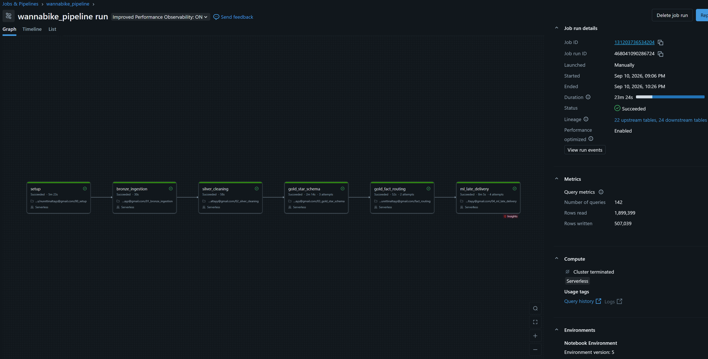
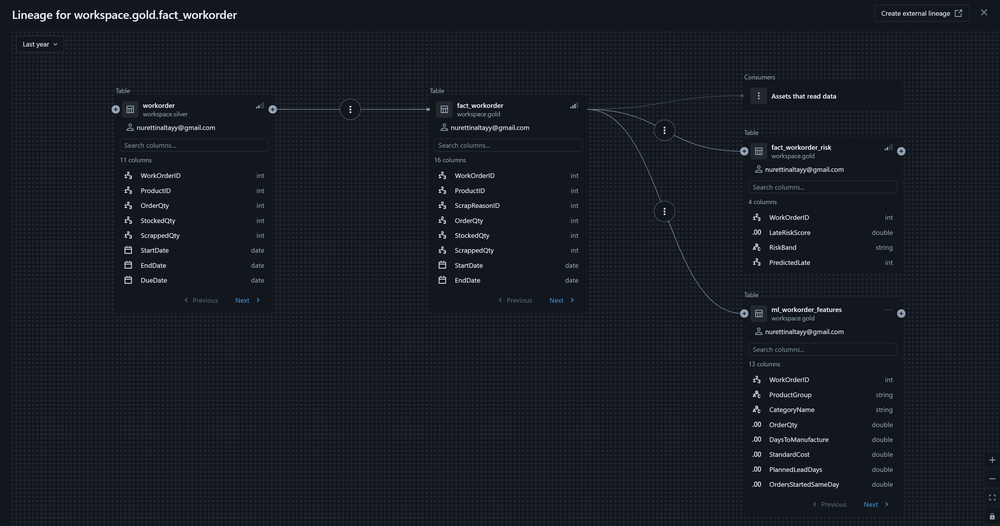
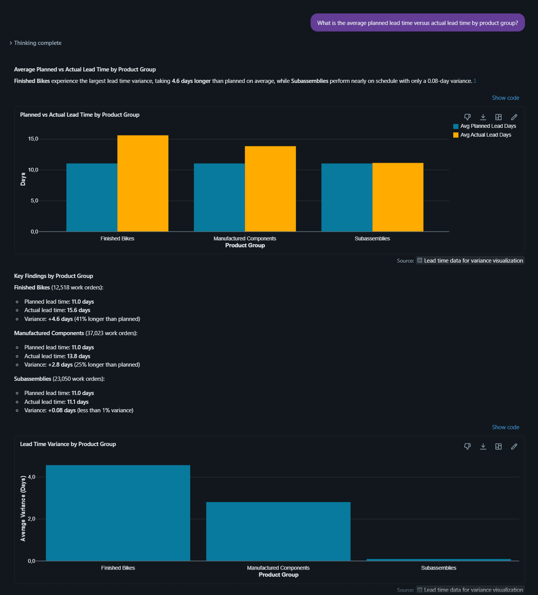
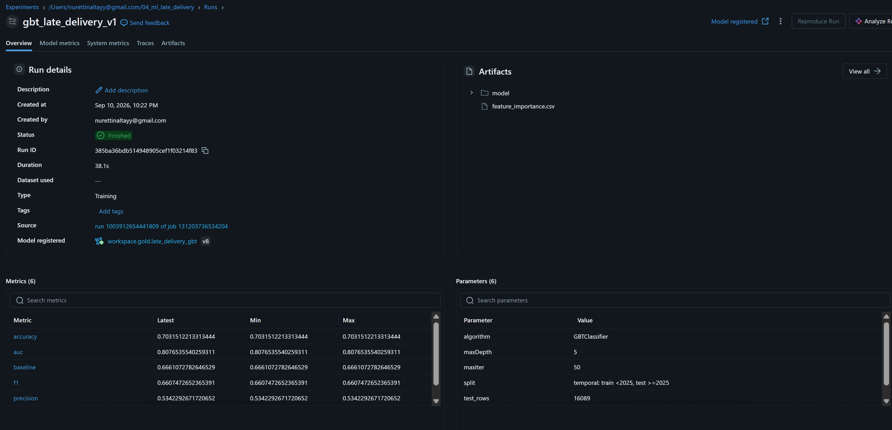

# WannaBike Production Intelligence

End-to-end lakehouse solution for manufacturing production analysis — built on Databricks (PySpark, Delta Lake, Unity Catalog), with a machine learning model for late-delivery prediction and a Power BI reporting layer.

*Personal portfolio project, 2026.*

## Overview

WannaBike is a bicycle manufacturer. This project analyzes three years of production data — **72,591 work orders** and **67,131 routing (operation-step) records** — to answer a simple question: *why are so many work orders late, and can it be predicted?*

The same problem was originally solved with SSIS, SQL Server and Power BI during my data analytics retraining program. This repository is a full migration of that solution to a modern lakehouse architecture, built independently to learn Databricks, PySpark and Unity Catalog end to end.

## Key finding

31% of work orders are delivered late. The first hypothesis was a production bottleneck. The data rejected it: all seven work stations show nearly identical delay rates (57–63%), and the delay rate has been flat for three years even as volume tripled.

What actually explains it: **the planning system assigns every product type the same 11-day lead time**, but actual lead time varies sharply by product group:

| Product group | Work orders | Planned lead time | Actual lead time | Gap | Late % |
|---|---|---|---|---|---|
| Finished Bikes | 12,518 | 11.0 days | 15.6 days | +4.6 | 56.0% |
| Manufactured Components | 37,023 | 11.0 days | 13.8 days | +2.8 | 36.3% |
| Subassemblies | 23,050 | 11.0 days | 11.1 days | +0.1 | 10.2% |

The larger the gap between planned and actual lead time, the higher the late rate. This is not a capacity problem — it is a single planning parameter that doesn't account for product differences. Giving Finished Bikes a 16-day lead time instead of 11 would eliminate most of the delay.

## Architecture

```
                 ┌─────────────┐     ┌─────────────┐     ┌─────────────┐
  8 source CSVs  │   BRONZE    │ --> │   SILVER    │ --> │    GOLD     │ --> Power BI
  (raw files)    │ raw ingest  │     │ typed/clean │     │ star schema │     Genie (NL Q&A)
                 └─────────────┘     └─────────────┘     └──────┬──────┘
                                                                  │
                                                          ┌───────▼───────┐
                                                          │  ML (Spark ML) │
                                                          │  GBTClassifier │
                                                          │  + MLflow      │
                                                          └────────────────┘
```

**Medallion layers** (PySpark + Delta Lake, Unity Catalog):
- **Bronze** — 8 raw CSVs ingested as-is into Delta tables, with source/ingestion metadata.
- **Silver** — typed, cleaned, validated. Two source date formats reconciled to avoid silent data loss.
- **Gold** — dimensional star schema with two fact tables at different grains:
  - `fact_workorder` (72,591 rows, grain: one row per work order)
  - `fact_routing` (67,131 rows, grain: one row per operation step)
  - `fact_workorder_risk` (72,591 rows, ML risk scores)
  - Conformed dimensions: `dim_product`, `dim_location`, `dim_scrap_reason`, `dim_date`
  - Primary/foreign key constraints declared for documentation and correct join inference by Genie

**Orchestration** — a Databricks Job chains all layers with explicit task dependencies (Setup → Bronze → Silver → Gold [star schema + routing fact, in parallel] → ML), fully idempotent (every task reads from and writes to tables, safe to re-run end to end), with failure-notification alerting.

**Machine learning** — a GBTClassifier (Spark ML) predicts whether a work order will be late, logged and versioned in MLflow, with risk scores written back to the gold layer for use in Power BI and Genie.

**AI layer** — natural-language querying via Databricks Genie over the gold layer. I authored and corrected the semantic layer's instructions, including grain rules that prevent work orders from being double-counted when Genie joins against the operation-step-level fact table.

**Reporting** — a Power BI dashboard (Import mode, Databricks SQL Warehouse connector) covering production volume, delivery performance, quality/scrap analysis, and model-driven risk scoring.

## Machine learning results

**Model:** GBTClassifier (Spark ML), maxIter=50, maxDepth=5
**Split:** Temporal — train on 2022–2024 (56,502 rows), test on 2025 (16,089 rows), to avoid look-ahead bias
**Target:** `IsLate` (0/1)

| Metric | Value |
|---|---|
| Baseline (always predict "on time") | 0.666 |
| Accuracy | 0.703 |
| **AUC** | **0.808** |
| Precision (late) | 0.534 |
| **Recall (late)** | **0.866** |
| F1 (late) | 0.661 |

Of 5,372 actually-late work orders in the 2025 test set, the model catches 4,651 of them (86.6% recall) at the cost of 4,055 false alarms. This trade-off is deliberate: for a planner, missing a real delay is more costly than double-checking a work order that turns out fine, so recall was prioritized over precision.

**Risk bands**, used directly in the Power BI dashboard and by Genie:

| Band | Work orders | Actual late % | Model-predicted % |
|---|---|---|---|
| High (score ≥ 0.70) | 7,809 | 72.9% | 86.6% |
| Medium (0.40–0.70) | 31,780 | 51.5% | 51.8% |
| Low (< 0.40) | 33,002 | 2.2% | 5.7% |

**Feature importance** confirms the planning-parameter finding: `PlannedLeadDays` carries almost no signal (0.023) because it is nearly constant across all products (always ~11 days) — exactly what you'd expect if the planning system isn't differentiating by product. The engineered feature `OrdersStartedSameDay` (system-load proxy) ranks third (0.155), supporting the system-load hypothesis that was tested and rejected as the *primary* cause, but still contributes.

## A data-quality finding worth calling out

While rebuilding the star schema, I found that the **previous Power BI model's fact table was at the wrong grain**: it was named `FactProductionWorkOrder` but actually held one row per operation step, not per work order (evidenced by `Late Orders + On-time Orders` summing to exactly 67,131 — the operation-step row count). This inflated the on-time rate calculation:

| Metric | Old (wrong) | New (correct) |
|---|---|---|
| Work Orders | 67K | 72,591 |
| On-Time % | 45.7% | **68.6%** |
| Late Orders | 36K | 22,790 |

Getting the grain right — one fact table per work order, one per operation step — was the fix, and it's the same grain rule now encoded into the Genie semantic layer so it can't recur.

## Tech stack

`Databricks` · `PySpark` · `Delta Lake` · `Unity Catalog` · `Spark ML` · `MLflow` · `Databricks Genie` · `Power BI` · `DAX`
## Screenshots

**Orchestration — full pipeline run**


**Unity Catalog lineage**


**Genie — natural language query**


**MLflow — model run metrics**


## Repository structure

```
notebooks/
├── 00_setup.py                  Unity Catalog schemas, volumes
├── 01_bronze_ingestion.py       CSV -> Bronze Delta tables
├── 02_silver_cleaning.py        Typing, cleaning, validation
├── 03_gold_star_schema.py       Dimensions + fact_workorder + constraints
├── 04_ml_late_delivery.py       Feature engineering, GBTClassifier, MLflow logging 
└── fact_routing.py              fact_routing (operation-step grain)

docs/
├── findings.md                  Full analysis write-up (data quality, root cause, ML results)
└── screenshots/
    ├── catalog_lineage.png      Unity Catalog lineage graph
    ├── genie_answer.png         Genie natural-language query example
    └── mlflow_metrics.png       MLflow experiment run / model metrics

dashboard/
└── WannaBike_Production_Databricks.pdf   Power BI dashboard export
```

## Data source

Data is a synthetic AdventureWorks-style manufacturing dataset, extended with realistic scrap/delay patterns for this project.

---

*Built by Nurettin Altay as a personal project during a data & analytics retraining program.*
